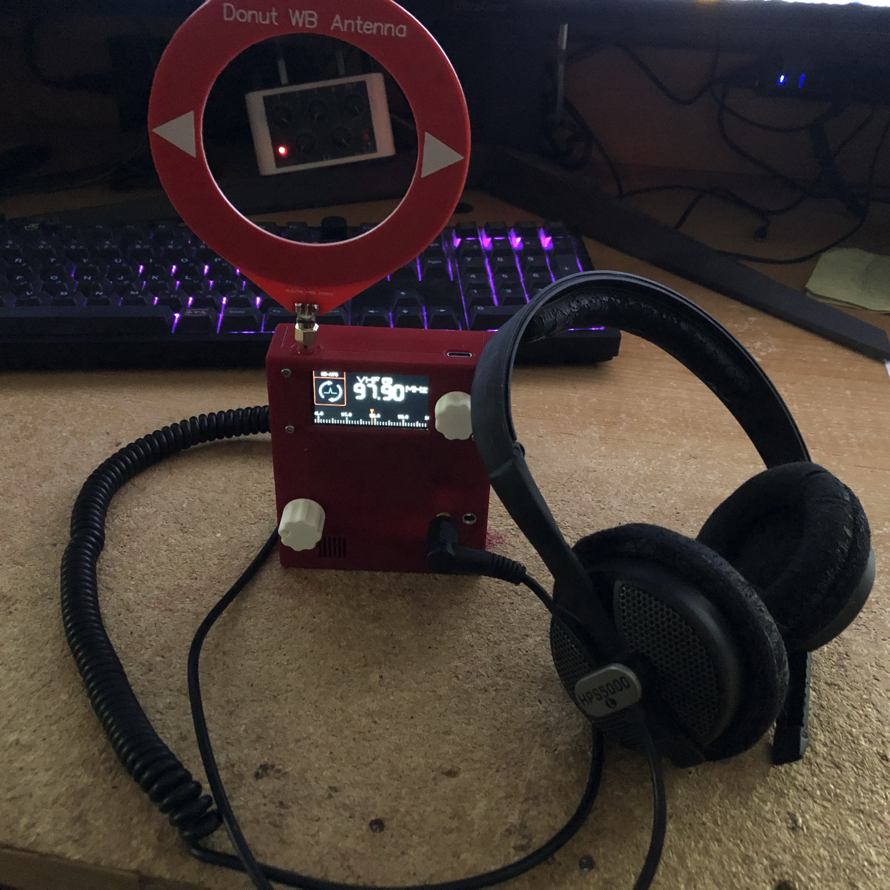
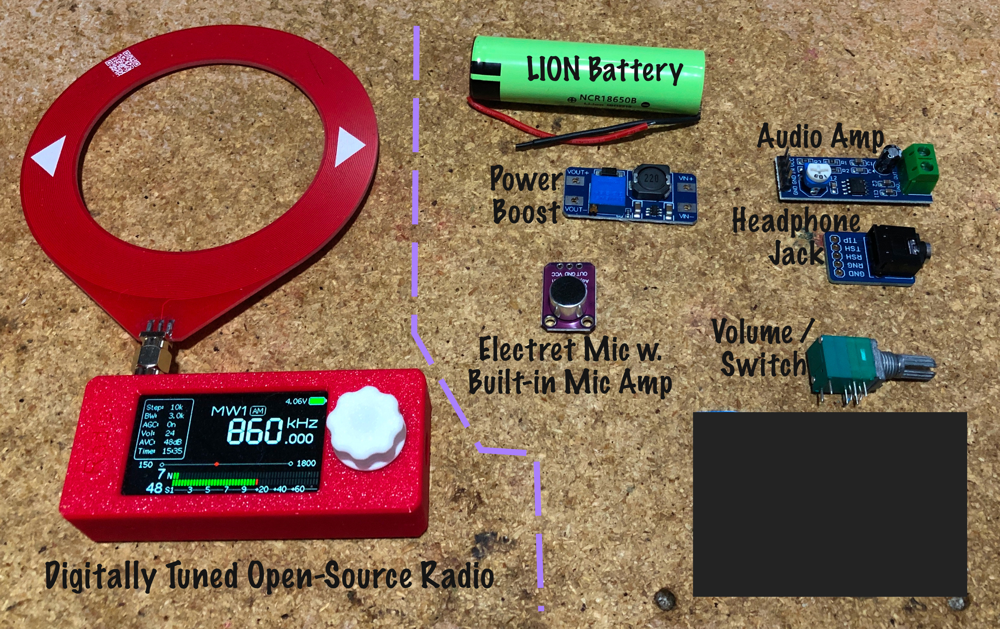
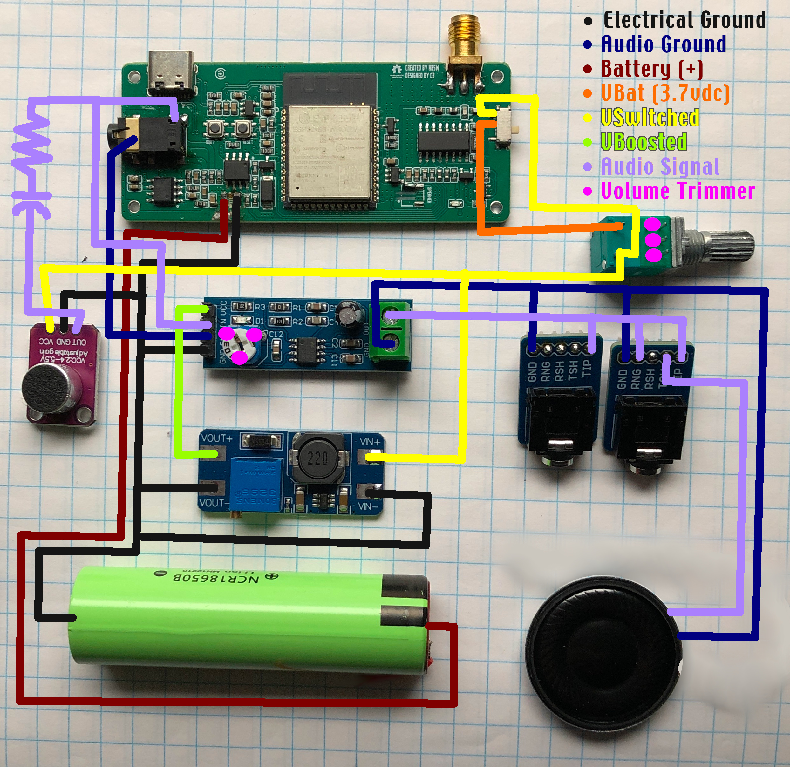
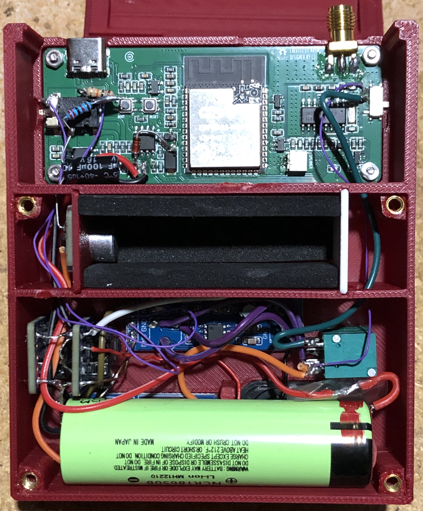

# Theory / Concept / Inspiration

SB-ATS is a Spirit Box (or ghost box) based on the ATS-Mini radio. 

What is a Spirit Box? To paraphrase Greg Newkirk (from Planet Weird, Haunted Objects Podcast, Hellier, & more), it is: A radio that's been intentionally broken in a very specific way, in order to facilitate communications with ghosts, spirits, aliens, or ultraterrestrials.

The SB-7 is a well-known example, as are Frank Sumption's Ghost Boxes.

After a recent Haunted Objects Podcast series took a closer look at Instrumental Trans-Communication (aka ITC), we and our girlfriend were inspired to try and build our own take on the concept. We'd recently found out about the ATS-Mini and its enthusiastic following, and being vaguely familiar with its hardware and software we thought it would be a perfect candidate to build our own Spirit Box around.

Our goal was to build something small & lightweight like the SB-7, that also incorporated some of the 'special sauce' from Frank's Boxes.

The SB-ATS is what we've come up with. 

If you're interest in any of this stuff, we highly recommend checking out the following Haunted Objects Podcast episodes for more information:
* https://youtu.be/vKKJDyz5v9s?si=yHpFtwpSJTk9lLV8
* https://youtu.be/RcoLuyAZ9i8?si=7ffe344x2f6HuvYi
* https://youtu.be/FX2DBT95mBo?si=R7OyNMxOrRMWFfxy

Read about Frank Sumption's original designs here:
* https://www.scribd.com/doc/149011303/Franks-Box-6-19

The ATS-Mini project documentation can be found here:
* https://esp32-si4732.github.io/ats-mini/

# Operation

The radio side of things is fairly simple since it's still basically an ATS-Mini at heart, we've just added an extra menu function. First select your band (VHF or MW are best, but it works with any available band). Optionally you can also set your step size. 

When you're ready, select the SB-ATS option from the menu and the radio begins sweeping up (or down) the band. When it gets to a band edge it will roll over and continue until you stop it.

To exit SB-ATS mode just click the encoder, the radio will return to normal functions.

And finally, while in SB-ATS mode you can change the sweep direction by turning the encoder left or right.

For the ITC side of things, we strongly recommend using a quality set of headphones. If you want to employ the Estes method then a set of noise-attenuating (not noise cancelling!) drummers' headphones are recommended. For our own purposes we've had fairly good results with a basic set of studio 'phones.

# Bill of Materials

* ATS-Mini Radio, available on Alliexpress. We use version 1 for this project.
* MAX4466 Electret Mic Module, we sourced ours from Amazon
* LM386 Audio Amp Module, also sourced from Amazon
* MT3608 DC-DC Boost Module, also source from Amazon
* 16550 Lithium battery, from Alliexpress
* 10k volume pot with integrated switch
* 100uF electrolytic capacitor
* 10k - 33k resistor (see below for info)
* 3.5mm stereo jack (5 pin, tip-ring-sleeve, with sunts) (two required)
* hookup wire, solder, tools, etc.

  

# Electronics Assembly Notes

Basically we're intercepting the audio output from the ATS-Mini at the built-in headphone jack, then re-routing it through some extra components. This results in additional noise and degraded audio quality, which is kind of the point.

Our original plan was to incorporate an 'echo box' based on Frank Sumption's design, but we were unable to find enough detailed information regarding how that part of Frank's Boxes was actually deisgned or constructed. After a few design attempts were stymied we opted for a second-best design.

The electret mic module is installed in its own isolated (and marginally sound-proofed) space within the SB-ATS enclosure. Its purpose is not to capture traditional audio (as in, it's not there to detect vibrations of the ambient air), but rather it's there to offer an additional path for potential communications - either by vibrating the mic's diaphragm, or directly manipulating the EM fields around it.

Audio out from the ATS-Mini headphone jack is mixed with the audio out from the mic module (with built-in pre-amp). Unfortunately the mic module we're using has a DC bias to its output (bias is vcc / 2), so before we tie that to the radio's output we put it through a 100uF capacitor in series with a resistor. The resistor value may vary depending on your set-up, we've found 10k to 33k is around the correct range.

This blended audio is fed together into a single-channel LM386 audio amp. This amp module needs at least 5 vdc which is higher than the ~3.7 volts available to us, so we're powering it with a DC-DC boost module based on the MT3608. We have this adjusted to supply between 7 and 9 volts. 

An analog volume control is used to set the desired output level, and the (mono) signal is routed through both Left and Right sides of a 3.5 mm stereo headphones jack. The shunt signal is then directed to the built-in speaker, which has been positioned at the front of the new enclosure.

In addition, a second 3.5 mm jack is provided as an 'Aux-Out', incase researchers would like to record the SB-ATS audio feed directly. This jack carries audio on the left line only, the idea being researchers could also record ambient location sounds on the right channel then compare the two later. This may be of particular interest to people employing the Estes method.

Finally, we opted to replace the original ~800 mAh battery with a larger 16550 unit, although this is optional. We mostly did it because we had a few of the bigger batteries onhand, and we weren't sure what sort of additional demand the additional audio components would put on the battery.

  

# Enclosure Hardware Assembly Notes

The box itself is 3d printed. All the stl files are included in this repository, along with a 3mf file that's formatted for the Bambu P1S.

The enclosure's a little rough around the edges, but it definitely works as proof-of-concept. 

You can use either hot-melt glue or superglue to fasten the various modules into the lower half of the enclosure. Our volume-power knob came with a threaded nut which holds it down. The ATS-Mini screen and mainboard may require a little fiddling to fit it into place. Then it can be held down with short self-tapping screws in the four corners. 

Or if you strip the plastic like we did on one of our prototypes, you can drill the mounting holes straight through then use M2x10 bolts and nuts to secure the ATS-Mini mainboard.

The back plate is secured with M3x6 bolts, which thread into M3 heat-set nuts (4.2mm od) in the front enclosure.

# Firmware

Please see here for the firmware:
https://github.com/PurpleCatGirl/sb-ats_firmware
